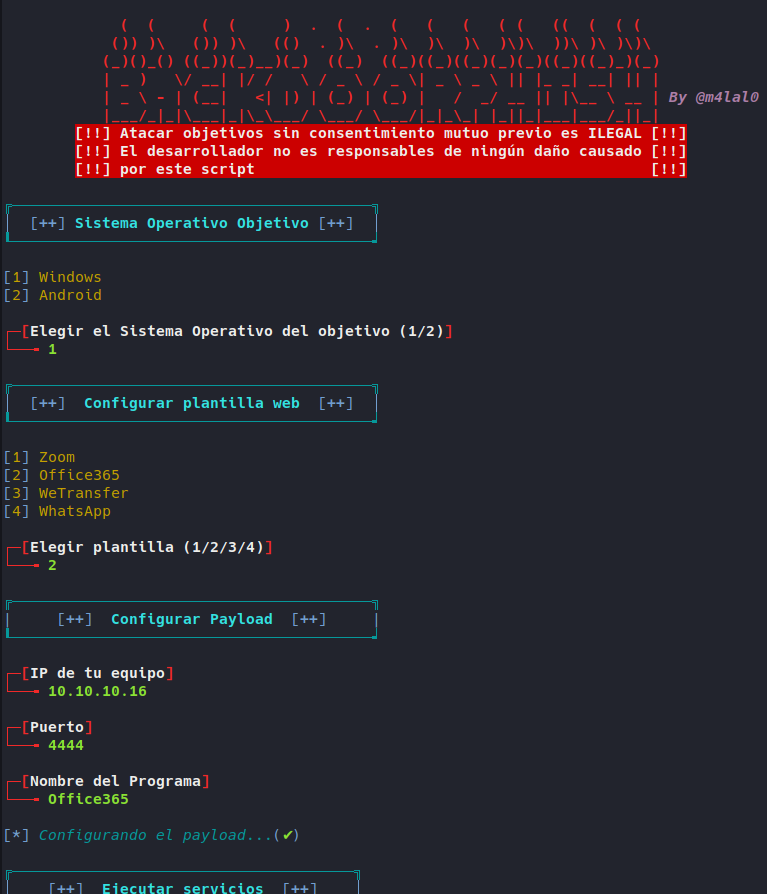

# BackdoorPhish

[](#)
[](#)
[](#)
[](#)
[](#)
[](#)
[](#)
[](#)
[](#)


Herramienta de ingeniería social [*Creador de puerta trasera con Reverse Shell para Windows/Android*] con Ngrok.

## Instalación

Ejecutarlo como root:

```bash
git clone https://github.com/m4lal0/backdoorPhish
cd backdoorPhish; chmod +x backdoorPhish.sh
```

Al ejecutarlo realizará la instalación automática de las dependencias para su ejecución correcta.

## Uso

```bash
./backdoorPhish.sh
```

1. Elegir el Sistema Operativo a atacar
2. Elegir Plantilla Web a desplegar
3. Configurar el Payload
4. Enviar URL configurada al objetivo
5. Esperar a que descargue y ejecute el programa el objetivo para obtener el acceso. 



## Caracteristicas

+ Plantillas webs preconfiguradas
+ Enmascaramiento de URL
+ Cifrado de Payload para Android
+ Fácil para principiantes

## Actualizar la herramienta

Para actualizar la herramienta es necesario utilizar el parámetro **--update**, con ello verificará si existe una nueva versión y si es asi nos preguntará si queremos actualizarla.

```bash
./backdoorPhish.sh --update
```

## Nota Legal
El uso de BackdoorPhish para atacar objetivos sin el consentimiento mutuo previo es ilegal. Es responsabilidad del usuario final obedecer todas las leyes locales, estatales y federales aplicables. El desarrollador no asume ninguna responsabilidad y no es responsable de ningún mal uso o daño causado por este programa. **El uso es exclusivamente para fines educativos y hacer conciencia a los usuarios.**